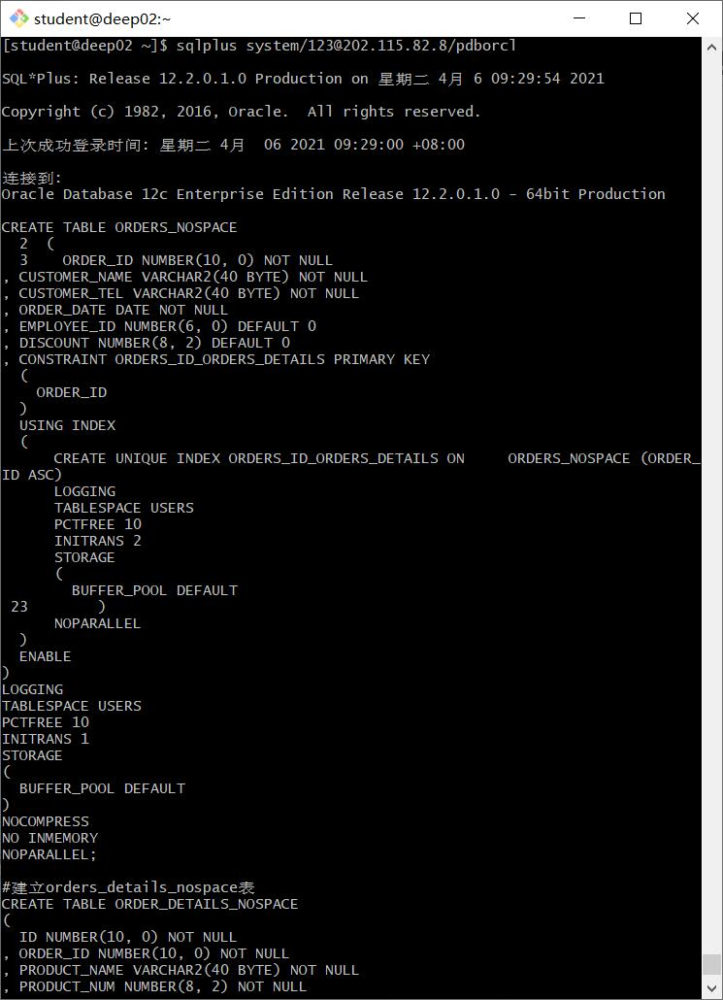

# 作业3

姓名：李源源

学号：201810414117

班级：软件工程1班

### 实验目的

掌握分区表的创建方法，掌握各种分区方式的使用场景。

### 实验内容

- 本实验使用3个表空间：USERS,USERS02,USERS03。在表空间中创建两张表：订单表(orders)与订单详表(order_details)。
- 使用**你自己的账号创建本实验的表**，表创建在上述3个分区，自定义分区策略。
- 你需要使用system用户给你自己的账号分配上述分区的使用权限。你需要使用system用户给你的用户分配可以查询执行计划的权限。
- 表创建成功后，插入数据，数据能并平均分布到各个分区。每个表的数据都应该大于1万行，对表进行联合查询。
- 写出插入数据的语句和查询数据的语句，并分析语句的执行计划。
- 进行分区与不分区的对比实验。

### 实验步骤

在自己的用户中创建自己的分区

```sql
首先创建自己的账号new_user_czm，然后以system身份登录:
[student@deep02 ~]$sqlplus system/123@localhost/pdborcl
SQL>ALTER USER new_user_czm QUOTA UNLIMITED ON USERS;
SQL>ALTER USER new_user_czm QUOTA UNLIMITED ON USERS02;
SQL>ALTER USER new_user_czm QUOTA UNLIMITED ON USERS03;
SQL>exit
然后以自己的账号new_user_czm身份登录,并运行脚本文件test3.sql:
[student@deep02 ~]$cat test3.sql
[student@deep02 ~]$sqlplus new_user_czm/123@localhost/pdborcl
SQL>@test3.sql
SQL>exit
```


在主表orders和从表order_details之间建立引用分区 在study用户中创建两个表：orders（订单表）和order_details（订单详表），两个表通过列order_id建立主外键关联。orders表按范围分区进行存储，order_details使用引用分区进行存储。

```sql
CREATE TABLE ORDERS
(ORDER_ID NUMBER(10, 0) NOT NULL
, CUSTOMER_NAME VARCHAR2(40 BYTE) NOT NULL
, CUSTOMER_TEL VARCHAR2(40 BYTE) NOT NULL
, ORDER_DATE DATE NOT NULL
, EMPLOYEE_ID NUMBER(6, 0) NOT NULL
, DISCOUNT NUMBER(8, 2) DEFAULT 0
, TRADE_RECEIVABLE NUMBER(8, 2) DEFAULT 0
, CONSTRAINT ORDERS_PK PRIMARY KEY
  (
    ORDER_ID
  )
  USING INDEX
  (
    CREATE UNIQUE INDEX ORDERS_PK ON ORDERS (ORDER_ID ASC)
  LOGGING
  TABLESPACE USERS
  PCTFREE 10
  INITRANS 2
  STORAGE
  (
    BUFFER_POOL DEFAULT
  )
  NOPARALLEL
  )
  ENABLE
)
TABLESPACE USERS
PCTFREE 10
INITRANS 1
STORAGE
(
  BUFFER_POOL DEFAULT
)
NOCOMPRESS
NOPARALLEL
PARTITION BY RANGE (ORDER_DATE)
(
  PARTITION PARTITION_2015 VALUES LESS THAN (TO_DATE    ('2016-01-01 00:00:00', 'SYYYY-MM-DD     HH24:MI:SS',     'NLS_CALENDAR=GREGORIAN'))
  NOLOGGING
  TABLESPACE USERS
  PCTFREE 10
  INITRANS 1
  STORAGE
  (
    INITIAL 8388608
    NEXT 1048576
    MINEXTENTS 1
    MAXEXTENTS UNLIMITED
    BUFFER_POOL DEFAULT
  )
  NOCOMPRESS NO INMEMORY
, PARTITION PARTITION_2016 VALUES LESS THAN (TO_DATE    ('2017-01-01 00:00:00', 'SYYYY-MM-DD     HH24:MI:SS',     'NLS_CALENDAR=GREGORIAN'))
  NOLOGGING
  TABLESPACE USERS
  PCTFREE 10
  INITRANS 1
  STORAGE
  (
    BUFFER_POOL DEFAULT
  )
  NOCOMPRESS NO INMEMORY
, PARTITION PARTITION_2017 VALUES LESS THAN (TO_DATE    ('2018-01-01 00:00:00', 'SYYYY-MM-DD     HH24:MI:SS',     'NLS_CALENDAR=GREGORIAN'))
  NOLOGGING
  TABLESPACE USERS
  PCTFREE 10
  INITRANS 1
  STORAGE
  (
    BUFFER_POOL DEFAULT
  )
  NOCOMPRESS NO INMEMORY
, PARTITION PARTITION_2018 VALUES LESS THAN (TO_DATE    ('2019-01-01 00:00:00', 'SYYYY-MM-DD     HH24:MI:SS',     'NLS_CALENDAR=GREGORIAN'))
  NOLOGGING
  TABLESPACE USERS02
  PCTFREE 10
  INITRANS 1
  STORAGE
  (
    BUFFER_POOL DEFAULT
  )
  NOCOMPRESS NO INMEMORY
, PARTITION PARTITION_2019 VALUES LESS THAN (TO_DATE    ('2020-01-01 00:00:00', 'SYYYY-MM-DD     HH24:MI:SS',     'NLS_CALENDAR=GREGORIAN'))
  NOLOGGING
  TABLESPACE USERS02
  PCTFREE 10
  INITRANS 1
  STORAGE
  (
    BUFFER_POOL DEFAULT
  )
  NOCOMPRESS NO INMEMORY
, PARTITION PARTITION_2020 VALUES LESS THAN (TO_DATE    ('2021-01-01 00:00:00', 'SYYYY-MM-DD     HH24:MI:SS',     'NLS_CALENDAR=GREGORIAN'))
  NOLOGGING
  TABLESPACE USERS02
  PCTFREE 10
  INITRANS 1
  STORAGE
  (
    BUFFER_POOL DEFAULT
  )
  NOCOMPRESS NO INMEMORY
, PARTITION PARTITION_2021 VALUES LESS THAN (TO_DATE    ('2022-01-01 00:00:00', 'SYYYY-MM-DD     HH24:MI:SS',     'NLS_CALENDAR=GREGORIAN'))
  NOLOGGING
  TABLESPACE USERS03
  PCTFREE 10
  INITRANS 1
  STORAGE
  (
    BUFFER_POOL DEFAULT
  )
  NOCOMPRESS NO INMEMORY
   );
```

在用户new_user_czm中创建表：order_details（订单详情表）

```sql
CREATE TABLE order_details
(
id NUMBER(10, 0) NOT NULL
, order_id NUMBER(10, 0) NOT NULL
, product_name VARCHAR2(40 BYTE) NOT NULL
, product_num NUMBER(8, 2) NOT NULL
, product_price NUMBER(8, 2) NOT NULL
, CONSTRAINT order_details_fk1 FOREIGN KEY  (order_id)
REFERENCES orders  (  order_id   )
ENABLE
)
TABLESPACE USERS
PCTFREE 10 INITRANS 1
STORAGE (BUFFER_POOL DEFAULT )
NOCOMPRESS NOPARALLEL
PARTITION BY REFERENCE (order_details_fk1);
```

以用户sys创建无分区表

```sql
CREATE TABLE ORDERS_NOSPACE 
(
  ORDER_ID NUMBER(10, 0) NOT NULL 
, CUSTOMER_NAME VARCHAR2(40 BYTE) NOT NULL 
, CUSTOMER_TEL VARCHAR2(40 BYTE) NOT NULL 
, ORDER_DATE DATE NOT NULL 
, EMPLOYEE_ID NUMBER(6, 0) DEFAULT 0 
, DISCOUNT NUMBER(8, 2) DEFAULT 0 
, CONSTRAINT ORDERS_ID_ORDERS_DETAILS PRIMARY KEY 
  (
    ORDER_ID 
  )
  USING INDEX 
  (
      CREATE UNIQUE INDEX ORDERS_ID_ORDERS_DETAILS ON     ORDERS_NOSPACE (ORDER_ID ASC) 
      LOGGING 
      TABLESPACE USERS 
      PCTFREE 10 
      INITRANS 2 
      STORAGE 
      ( 
        BUFFER_POOL DEFAULT 
      ) 
      NOPARALLEL 
  )
  ENABLE 
) 
LOGGING 
TABLESPACE USERS 
PCTFREE 10 
INITRANS 1 
STORAGE 
( 
  BUFFER_POOL DEFAULT 
) 
NOCOMPRESS 
NO INMEMORY 
NOPARALLEL;

#建立orders_details_nospace表
CREATE TABLE ORDER_DETAILS_NOSPACE 
(
  ID NUMBER(10, 0) NOT NULL 
, ORDER_ID NUMBER(10, 0) NOT NULL 
, PRODUCT_NAME VARCHAR2(40 BYTE) NOT NULL 
, PRODUCT_NUM NUMBER(8, 2) NOT NULL 
, PRODUCT_PRICE NUMBER(8, 2) NOT NULL 
) 
LOGGING 
TABLESPACE USERS 
PCTFREE 10 
INITRANS 1 
STORAGE 
( 
  INITIAL 65536 
  NEXT 1048576 
  MINEXTENTS 1 
  MAXEXTENTS UNLIMITED 
  BUFFER_POOL DEFAULT 
) 
NOCOMPRESS 
NO INMEMORY 
NOPARALLEL;

ALTER TABLE ORDER_DETAILS_NOSPACE
ADD CONSTRAINT ORDERS_FOREIGN_ORDERS_DETAILS FOREIGN KEY
(
  ORDER_ID 
)
REFERENCES ORDERS_NOSPACE
(
  ORDER_ID 
)
ENABLE;
```




对无分区表执行计划分析

```sql
--以system用户运行：
set autotrace on

select * from new_user_czm.orders where order_date
between to_date('2017-1-1','yyyy-mm-dd') and to_date('2018-6-1','yyyy-mm-dd');

select a.ORDER_ID,a.CUSTOMER_NAME,
b.product_name,b.product_num,b.product_price
from new_user_czm.orders a,new_user_czm.order_details b where
a.ORDER_ID=b.order_id and
a.order_date between to_date('2017-1-1','yyyy-mm-dd') and to_date('2018-6-1','yyyy-mm-dd');
```


#### 实验总结

通过本次实验，我了解到SQL Server数据库与Oracle数据库之间最大的区别要属表空间设计。Oracle数据库开创性地提出了表空间的设计理念，这为Oracle数据库的高性能做出了不可磨灭的贡献。可以这么说，Oracle中很多优化都是基于表空间的设计理念而实现的。