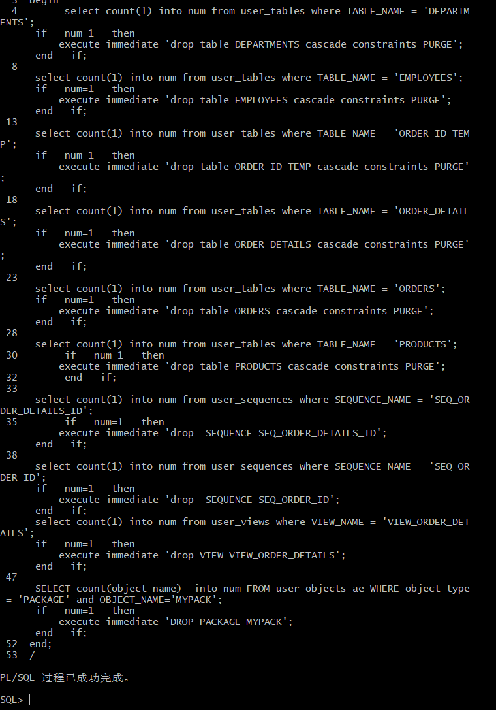
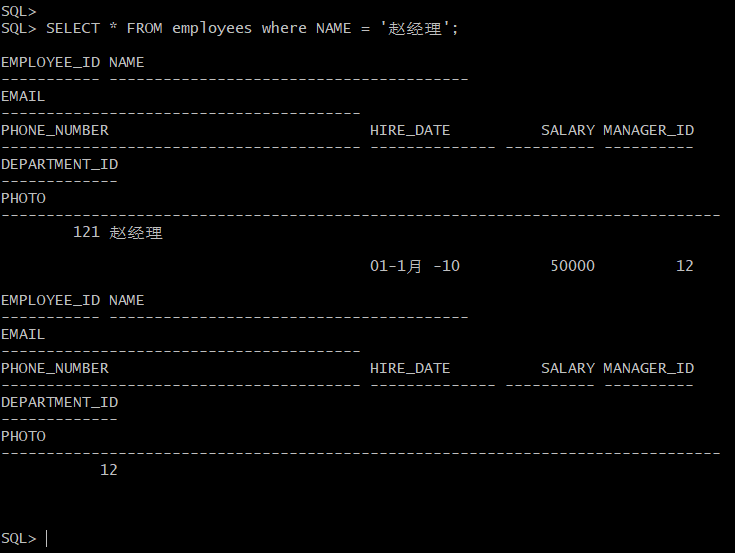
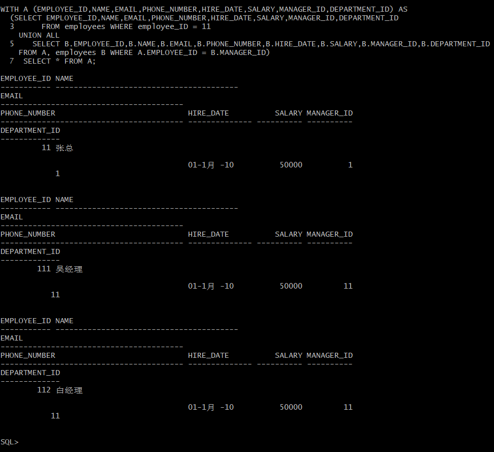
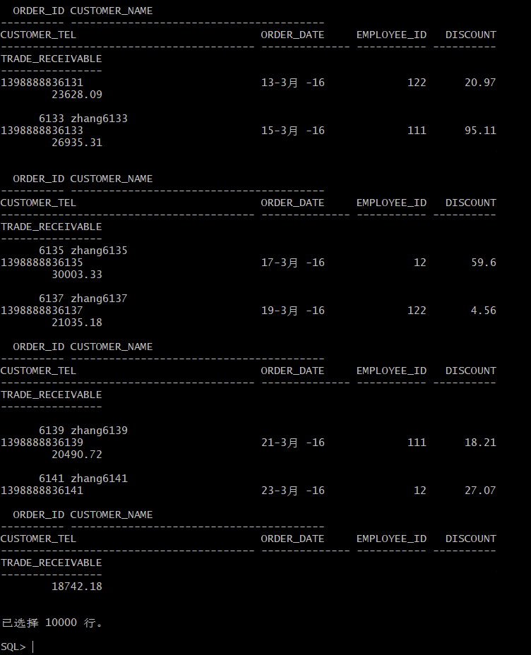
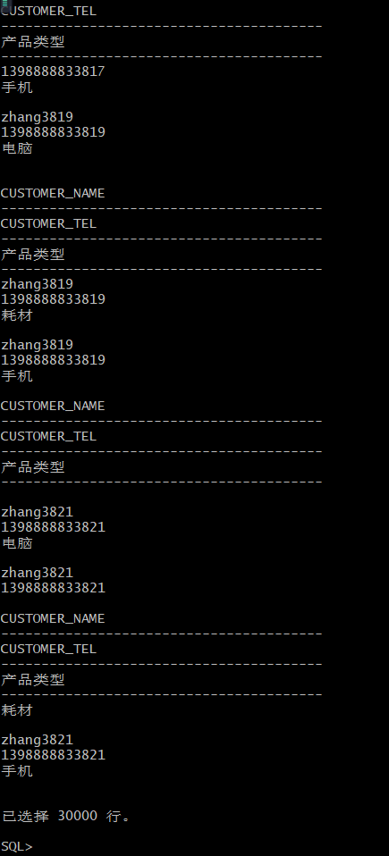
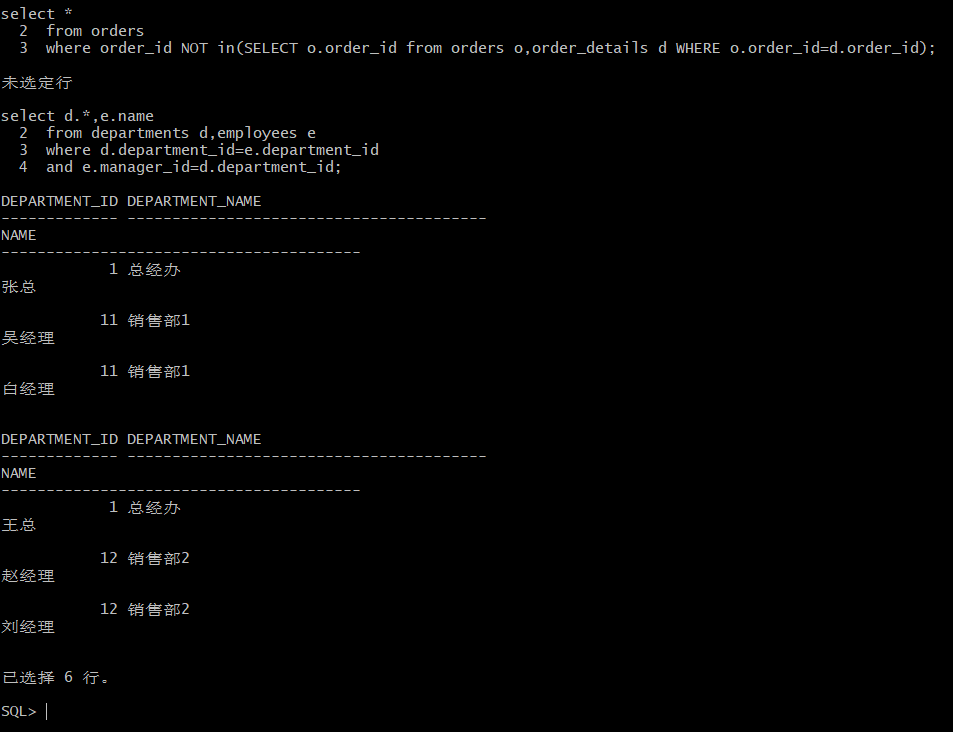
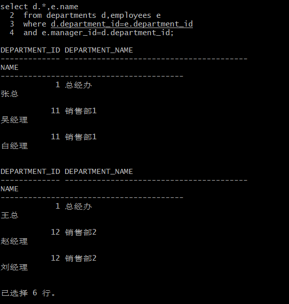
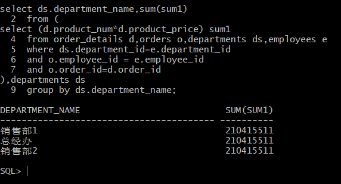

# 作业4

姓名：李源源

学号：201810414117

班级：软件工程1班

## 实验目的

了解Oracle表和视图的概念，学习使用SQL语句Create Table创建表，学习Select语句插入，修改，删除以及查询数据，学习使用SQL语句创建视图，学习部分存储过程和触发器的使用。

## 实验场景

假设有一个生产某个产品的单位，单位接受网上订单进行产品的销售。通过实验模拟这个单位的部分信息：员工表，部门表，订单表，订单详单表。

## 实验内容

#### 录入数据：

要求至少有1万个订单，每个订单至少有4个详单。至少有两个部门，每个部门至少有1个员工，其中只有一个人没有领导，一个领导至少有一个下属，并且它的下属是另一个人的领导（比如A领导B，B领导C）。

#### 序列的应用

插入ORDERS和ORDER_DETAILS 两个表的数据时，主键ORDERS.ORDER_ID, ORDER_DETAILS.ID的值必须通过序列SEQ_ORDER_ID和SEQ_ORDER_ID取得，不能手工输入一个数字。

#### 触发器的应用：

维护ORDER_DETAILS的数据时（insert,delete,update）要同步更新ORDERS表订单应收货款ORDERS.Trade_Receivable的值。

#### 查询数据：

```
1.查询某个员工的信息
2.递归查询某个员工及其所有下属，子下属员工。
3.查询订单表，并且包括订单的订单应收货款: Trade_Receivable= sum(订单详单表.ProductNum*订单详单表.ProductPrice)- Discount。
4.查询订单详表，要求显示订单的客户名称和客户电话，产品类型用汉字描述。
5.查询出所有空订单，即没有订单详单的订单。
6.查询部门表，同时显示部门的负责人姓名。
7.查询部门表，统计每个部门的销售总金额。
```

#### 创建表，分区以及插入数据

```
--- 运行脚本
--删除表和序列
--删除表的同时会一起删除主外键、触发器、程序包。
declare
      num   number;
begin
      select count(1) into num from user_tables where TABLE_NAME = 'DEPARTMENTS';
      if   num=1   then
          execute immediate 'drop table DEPARTMENTS cascade constraints PURGE';
      end   if;

      select count(1) into num from user_tables where TABLE_NAME = 'EMPLOYEES';
      if   num=1   then
          execute immediate 'drop table EMPLOYEES cascade constraints PURGE';
      end   if;

      select count(1) into num from user_tables where TABLE_NAME = 'ORDER_ID_TEMP';
      if   num=1   then
          execute immediate 'drop table ORDER_ID_TEMP cascade constraints PURGE';
      end   if;

      select count(1) into num from user_tables where TABLE_NAME = 'ORDER_DETAILS';
      if   num=1   then
          execute immediate 'drop table ORDER_DETAILS cascade constraints PURGE';
      end   if;

      select count(1) into num from user_tables where TABLE_NAME = 'ORDERS';
      if   num=1   then
          execute immediate 'drop table ORDERS cascade constraints PURGE';
      end   if;

      select count(1) into num from user_tables where TABLE_NAME = 'PRODUCTS';
      if   num=1   then
          execute immediate 'drop table PRODUCTS cascade constraints PURGE';
      end   if;

      select count(1) into num from user_sequences where SEQUENCE_NAME = 'SEQ_ORDER_DETAILS_ID';
      if   num=1   then
          execute immediate 'drop  SEQUENCE SEQ_ORDER_DETAILS_ID';
      end   if;

      select count(1) into num from user_sequences where SEQUENCE_NAME = 'SEQ_ORDER_ID';
      if   num=1   then
          execute immediate 'drop  SEQUENCE SEQ_ORDER_ID';
      end   if;
      select count(1) into num from user_views where VIEW_NAME = 'VIEW_ORDER_DETAILS';
      if   num=1   then
          execute immediate 'drop VIEW VIEW_ORDER_DETAILS';
      end   if;

      SELECT count(object_name)  into num FROM user_objects_ae WHERE object_type = 'PACKAGE' and OBJECT_NAME='MYPACK';
      if   num=1   then
          execute immediate 'DROP PACKAGE MYPACK';
      end   if;
end;
/
....
```



#### 查询步骤

- 1.查询某个员工的信息：

```
SELECT * FROM employees where NAME = '赵经理';
```



- 2.递归查询某个员工及其所有下属，子下属员工:

```
WITH A (EMPLOYEE_ID,NAME,EMAIL,PHONE_NUMBER,HIRE_DATE,SALARY,MANAGER_ID,DEPARTMENT_ID) AS
  (SELECT EMPLOYEE_ID,NAME,EMAIL,PHONE_NUMBER,HIRE_DATE,SALARY,MANAGER_ID,DEPARTMENT_ID
    FROM employees WHERE employee_ID = 11
    UNION ALL
  SELECT B.EMPLOYEE_ID,B.NAME,B.EMAIL,B.PHONE_NUMBER,B.HIRE_DATE,B.SALARY,B.MANAGER_ID,B.DEPARTMENT_ID
    FROM A, employees B WHERE A.EMPLOYEE_ID = B.MANAGER_ID)
SELECT * FROM A;
```



- 3.查询订单表，并且包括订单的订单应收货款: Trade_Receivable= sum(订单详单表.ProductNum*订单详单表.ProductPrice)- Discount:

```
select * FROM ORDERS
```



- 4.查询订单详表，要求显示订单的客户名称和客户电话，产品类型用汉字描述：

```
select o.customer_name,o.customer_tel, p.product_type AS 产品类型
FROM orders o,order_details d,products p
where o.order_id=d.order_id
and d.product_name=p.product_name
```



- 5.查询出所有空订单，即没有订单详单的订单。

```
select * 
from orders
where order_id NOT in(SELECT o.order_id from orders o,order_details d WHERE o.order_id=d.order_id)
```



- 6.查询部门表，同时显示部门的负责人姓名。

```
select d.*,e.name
from departments d,employees e
where d.department_id=e.department_id
and e.manager_id=d.department_id
```



- 7.查询部门表，统计每个部门的销售总金额。

```
select ds.department_name,sum(sum1)
from (
select (d.product_num*d.product_price) sum1
from order_details d,orders o,departments ds,employees e
where ds.department_id=e.department_id
and o.employee_id = e.employee_id
and o.order_id=d.order_id
),departments ds
group by ds.department_name
```



#### Oracle 对象管理 总结

通过本次实验，我大致了解了oracle的对象的相关知识，oracle的对象实际上指的是逻辑意义上的概念，并非物理意义上的，这些对象都放在用户下，这些对象又被称为schema对象。schema代表着某个用户下对象的集合，schema名称与用户名一致。不过schema与用户并非是完全相同的。如若用户下没有任何对象，那改用户也就并不存在schema，除非当用户已经具有了对象,用户才会具有schema。