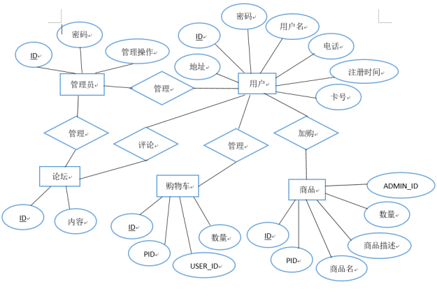
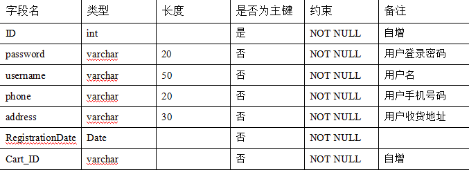
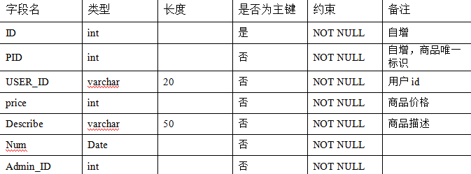
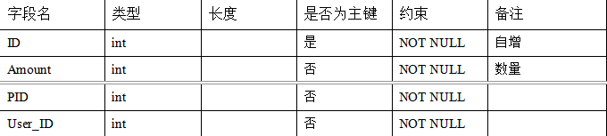
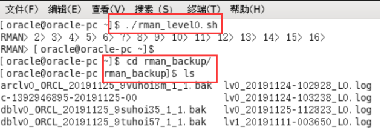
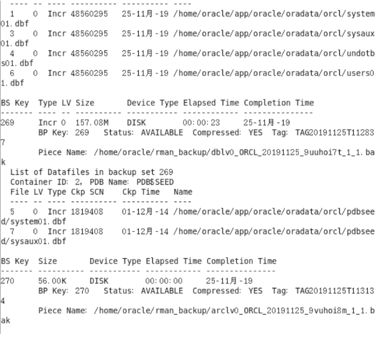
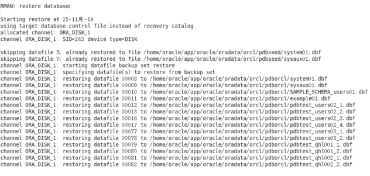
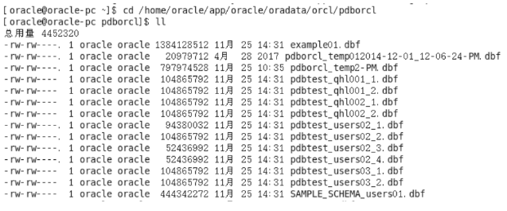

一、二手交易系统概述
随着Internet的发展和电子商务的日益普及，网络购物可以使顾客足不出户便可以方便快捷地选购自己喜欢的商品，比如二手物品等。因此，需要网上销售系统为网上交易活动提供一个高效、低成本的平台。该书籍交易系统能够满足用户进行网上交易活动的各项要求，能够使用户足不出户便可以方便快捷地出售或选购自己喜欢的二手商品。

二、概念模型设计（E-R图）

三、数据库表

3.1 管理员表

3.2用户表

3.3商品表

3.4购物车表
	

3.5论坛表

四、创建表空间

space__1
Create Tablespace space__1
datafile
'/home/oracle/app/oracle/oradata/orcl/pdborcl/pdbtest__1_1.dbf'
  SIZE 100M AUTOEXTEND ON NEXT 256M MAXSIZE UNLIMITED,
'/home/oracle/app/oracle/oradata/orcl/pdborcl/pdbtest__1_2.dbf'
  SIZE 100M AUTOEXTEND ON NEXT 256M MAXSIZE UNLIMITED
EXTENT MANAGEMENT LOCAL SEGMENT SPACE MANAGEMENT AUTO;

space__2
Create Tablespace space__2
datafile
'/home/oracle/app/oracle/oradata/orcl/pdborcl/pdbtest__2_1.dbf'
  SIZE 100M AUTOEXTEND ON NEXT 256M MAXSIZE UNLIMITED,
'/home/oracle/app/oracle/oradata/orcl/pdborcl/pdbtest__2_2.dbf'
  SIZE 100M AUTOEXTEND ON NEXT 256M MAXSIZE UNLIMITED
EXTENT MANAGEMENT LOCAL SEGMENT SPACE MANAGEMENT AUTO;

五、 创建角色及用户

用户默认使用表空间 space__1
创建第一个角色和用户

•创建角色 lyy1 将 connect,resource,create view 授权给 lyy1

•创建用户 lyy_1

•分配 60M 空间给 lyy_1 并将角色 lyy1 授权给用户 lyy_1
CREATE ROLE lyy1;
GRANT connect,resource,CREATE VIEW TO lyy1;
CREATE USER lyy_1 IDENTIFIED BY 123 DEFAULT TABLESPACE space__1 TEMPORARY TABLESPACE temp;
ALTER USER lyy_1 QUOTA 60M ON space__1;
GRANT lyy1 TO lyy_1;

创建第二个角色和用户
•创建角色 lyy2，将 connect,resource 权限给 lyy2

•创建用户 lyy_2

•分配 60M 空间给 lyy_2 并将角色 lyy2 授权给用户 lyy_2
CREATE ROLE lyy2;
GRANT connect,resource TO lyy2;
CREATE USER lyy_2 IDENTIFIED BY 123 DEFAULT TABLESPACE space__1 TEMPORARY TABLESPACE temp;
ALTER USER lyy_2 QUOTA 60M ON space__1;
GRANT lyy2 TO lyy_2;

六、在用户 lyy_1 下创建表

创建管理员表

•id 为主键

CREATE TABLE ADMINISTRATOR
(
  ID NUMBER(*, 0) NOT NULL
, PASSWORD VARCHAR2(20 BYTE) NOT NULL
, ADMIN VARCHAR2(20 BYTE) NOT NULL
, CONSTRAINT ADMINISTRATOR_PK PRIMARY KEY
  (
    ID
  )
  USING INDEX
  (
      CREATE UNIQUE INDEX ADMINISTRATOR_PK ON ADMINISTRATOR (ID ASC)
      LOGGING
      TABLESPACE SPACE__1
      PCTFREE 10
      INITRANS 2
      STORAGE
      (
        BUFFER_POOL DEFAULT
      )
      NOPARALLEL
  )
  ENABLE
)
LOGGING
TABLESPACE SPACE__1
PCTFREE 10
INITRANS 1
STORAGE
(
  BUFFER_POOL DEFAULT
)
NOCOMPRESS
NO INMEMORY
NOPARALLEL;

创建用户表

•id 为主键

•根据注册日期按范围分区

•分为 2018 和 2019 年两个分区，每年按季度划 4 个子分区

CREATE TABLE BOOKUSER
(
  ID NUMBER(*, 0) NOT NULL
, PASSWORD VARCHAR2(20 BYTE) NOT NULL
, USERNAME VARCHAR2(50 BYTE) NOT NULL
, PHONE VARCHAR2(20 BYTE) NOT NULL
, ADDRESS VARCHAR2(30 BYTE) NOT NULL
, REGISTRATIONDATE DATE NOT NULL
, CART_ID NUMBER(*, 0) NOT NULL
, CONSTRAINT U_PK PRIMARY KEY
  (
    ID
  )
  USING INDEX
  (
      CREATE UNIQUE INDEX U_PK ON BOOKUSER (ID ASC)
      LOGGING
      TABLESPACE SPACE__1
      PCTFREE 10
      INITRANS 2
      STORAGE
      (
        BUFFER_POOL DEFAULT
      )
      NOPARALLEL
  )
  ENABLE
)
TABLESPACE SPACE__1
PCTFREE 10
INITRANS 1
STORAGE
(
  BUFFER_POOL DEFAULT
)
NOCOMPRESS
NOPARALLEL
PARTITION BY RANGE (REGISTRATIONDATE)
SUBPARTITION BY RANGE (REGISTRATIONDATE)
(
  PARTITION DATE2018 VALUES LESS THAN (TO_DATE(' 2018-12-31 00:00:00', 'SYYYY-MM-DD HH24:MI:SS', 'NLS_CALENDAR=GREGORIAN'))
  TABLESPACE SPACE__1
  PCTFREE 10
  INITRANS 1
  STORAGE
  (
    BUFFER_POOL DEFAULT
  )
  NOCOMPRESS NO INMEMORY
  (
    SUBPARTITION DATE2018_3 VALUES LESS THAN (TO_DATE(' 2018-03-31 00:00:00', 'SYYYY-MM-DD HH24:MI:SS', 'NLS_CALENDAR=GREGORIAN'))
    NOCOMPRESS NO INMEMORY
  , SUBPARTITION DATE2018_6 VALUES LESS THAN (TO_DATE(' 2018-06-30 00:00:00', 'SYYYY-MM-DD HH24:MI:SS', 'NLS_CALENDAR=GREGORIAN'))
    NOCOMPRESS NO INMEMORY
  , SUBPARTITION DATE2018_9 VALUES LESS THAN (TO_DATE(' 2018-09-30 00:00:00', 'SYYYY-MM-DD HH24:MI:SS', 'NLS_CALENDAR=GREGORIAN'))
    NOCOMPRESS NO INMEMORY
  , SUBPARTITION DATE2018_12 VALUES LESS THAN (TO_DATE(' 2018-12-31 00:00:00', 'SYYYY-MM-DD HH24:MI:SS', 'NLS_CALENDAR=GREGORIAN'))
    NOCOMPRESS NO INMEMORY
  )
, PARTITION DATE2019 VALUES LESS THAN (TO_DATE(' 2019-12-31 00:00:00', 'SYYYY-MM-DD HH24:MI:SS', 'NLS_CALENDAR=GREGORIAN'))
  TABLESPACE SPACE__1
  PCTFREE 10
  INITRANS 1
  STORAGE
  (
    BUFFER_POOL DEFAULT
  )
  NOCOMPRESS NO INMEMORY
  (
    SUBPARTITION DATE2019_3 VALUES LESS THAN (TO_DATE(' 2019-03-31 00:00:00', 'SYYYY-MM-DD HH24:MI:SS', 'NLS_CALENDAR=GREGORIAN'))
    NOCOMPRESS NO INMEMORY
  , SUBPARTITION DATE2019_6 VALUES LESS THAN (TO_DATE(' 2019-06-30 00:00:00', 'SYYYY-MM-DD HH24:MI:SS', 'NLS_CALENDAR=GREGORIAN'))
    NOCOMPRESS NO INMEMORY
  , SUBPARTITION DATE2019_9 VALUES LESS THAN (TO_DATE(' 2019-09-30 00:00:00', 'SYYYY-MM-DD HH24:MI:SS', 'NLS_CALENDAR=GREGORIAN'))
    NOCOMPRESS NO INMEMORY
  , SUBPARTITION DATE2019_12 VALUES LESS THAN (TO_DATE(' 2019-12-31 00:00:00', 'SYYYY-MM-DD HH24:MI:SS', 'NLS_CALENDAR=GREGORIAN'))
    NOCOMPRESS NO INMEMORY
  )
);

创建商品表

CREATE TABLE COMMODITY
(
  ID NUMBER(*, 0) NOT NULL
, PID NUMBER(*, 0) NOT NULL
, BOOKSNAME VARCHAR2(20 BYTE) NOT NULL
, PRICE NUMBER NOT NULL
, DESCRIBE VARCHAR2(50 BYTE) NOT NULL
, NUM NUMBER(*, 0) NOT NULL
, ADMIN_ID NUMBER(*, 0) NOT NULL
, CONSTRAINT COMMODITY_PK PRIMARY KEY
  (
    ID
  )
  USING INDEX
  (
      CREATE UNIQUE INDEX COMMODITY_PK ON COMMODITY (ID ASC)
      LOGGING
      TABLESPACE SPACE__1
      PCTFREE 10
      INITRANS 2
      STORAGE
      (
        BUFFER_POOL DEFAULT
      )
      NOPARALLEL
  )
  ENABLE
)
LOGGING
TABLESPACE SPACE__1
PCTFREE 10
INITRANS 1
STORAGE
(
  BUFFER_POOL DEFAULT
)
NOCOMPRESS
NO INMEMORY
NOPARALLEL;

创建购物车表

•用户表字段 BOOKUSER_ID 为购物车表的外键

•购物车采用引用分区
CREATE TABLE CART
(
  ID NUMBER(*, 0) NOT NULL
, AMOUNT NUMBER(*, 0) NOT NULL
, PID NUMBER(*, 0) NOT NULL
, BOOKUSER_ID NUMBER(*, 0) NOT NULL
, CONSTRAINT CART_PK PRIMARY KEY
  (
    ID
  )
  USING INDEX
  (
      CREATE UNIQUE INDEX CART_PK ON CART (ID ASC)
      LOGGING
      TABLESPACE SPACE__1
      PCTFREE 10
      INITRANS 2
      STORAGE
      (
        BUFFER_POOL DEFAULT
      )
      NOPARALLEL
  )
  ENABLE
, CONSTRAINT CART_BOOKUSER FOREIGN KEY
  (
  BOOKUSER_ID
  )
  REFERENCES BOOKUSER
  (
  CART_ID
  )
  ENABLE
)
PCTFREE 10
PCTUSED 40
INITRANS 1
STORAGE
(
  BUFFER_POOL DEFAULT
)
NOCOMPRESS
NOPARALLEL
PARTITION BY REFERENCE (CART_BOOKUSER)
(
  PARTITION DATE2018_3
  LOGGING
  TABLESPACE SPACE__1
  PCTFREE 10
  INITRANS 1
  STORAGE
  (
    BUFFER_POOL DEFAULT
  )
  NOCOMPRESS NO INMEMORY
, PARTITION DATE2018_6
  LOGGING
  TABLESPACE SPACE__1
  PCTFREE 10
  INITRANS 1
  STORAGE
  (
    BUFFER_POOL DEFAULT
  )
  NOCOMPRESS NO INMEMORY
, PARTITION DATE2018_9
  LOGGING
  TABLESPACE SPACE__1
  PCTFREE 10
  INITRANS 1
  STORAGE
  (
    BUFFER_POOL DEFAULT
  )
  NOCOMPRESS NO INMEMORY
, PARTITION DATE2018_12
  LOGGING
  TABLESPACE SPACE__1
  PCTFREE 10
  INITRANS 1
  STORAGE
  (
    BUFFER_POOL DEFAULT
  )
  NOCOMPRESS NO INMEMORY
, PARTITION DATE2019_3
  LOGGING
  TABLESPACE SPACE__1
  PCTFREE 10
  INITRANS 1
  STORAGE
  (
    BUFFER_POOL DEFAULT
  )
  NOCOMPRESS NO INMEMORY
, PARTITION DATE2019_6
  LOGGING
  TABLESPACE SPACE__1
  PCTFREE 10
  INITRANS 1
  STORAGE
  (
    BUFFER_POOL DEFAULT
  )
  NOCOMPRESS NO INMEMORY
, PARTITION DATE2019_9
  LOGGING
  TABLESPACE SPACE__1
  PCTFREE 10
  INITRANS 1
  STORAGE
  (
    BUFFER_POOL DEFAULT
  )
  NOCOMPRESS NO INMEMORY
, PARTITION DATE2019_12
  LOGGING
  TABLESPACE SPACE__1
  PCTFREE 10
  INITRANS 1
  STORAGE
  (
    BUFFER_POOL DEFAULT
  )
  NOCOMPRESS NO INMEMORY
);

创建论坛表

CREATE TABLE TABLE1
(
  ID INT NOT NULL
, CONTENT NVARCHAR2(50) NOT NULL
, CONSTRAINT TABLE1_PK PRIMARY KEY
  (
    ID
  )
  ENABLE
);

完整表结构如下图所示

创建视图

•计算每个用户购车中单个商品的总价

create or replace  view view_SinglePriceSum
as
select b.id,b.username,co.booksname,(co.price*ca.amount) pricesum from COMMODITY co,cart ca,BOOKUSER b where co.pid=ca.pid and ca.BOOKUSER_ID =b.id;
select * from view_SinglePriceSum;

用户 lyy_1 空间不足，修改 lyy_1 空间大小

ALTER USER lyy_1 QUOTA 90M ON space__1;

七、插入用户、商品、购物车数据

declare
  id number(38,0);
  username varchar2(50);
  phone varchar2(20);
  address varchar2(30);
  REGISTRATIONDATE date;
  booksname varchar2(50);
  price number(5,2);
  num number(38,0);
  amount number(38,0);

begin
  for i in 1..50000
  loop
    if i mod 2 =0 then
      REGISTRATIONDATE:=to_date('2018-5-6','yyyy-mm-dd')+(i mod 60);
    else
      REGISTRATIONDATE:=to_date('2019-5-6','yyyy-mm-dd')+(i mod 60);
    end if;

    --插入用户
    id:=SEQ_ORDER_ID.nextval; --应该将SEQ_ORDER_ID.nextval保存到变量中。
    username := 'aa'|| 'aa';
    username := 'wang' || i;
    phone := '131785693' || i;
	booksname := '唐诗三百首版本号' || i;
	address :='成都'|| '四川';
	price :=(dbms_random.value() * 100);
	num :=(i mod 5);
    insert /*+append*/ into bookuser (id,password,username,phone,address,REGISTRATIONDATE,cart_id)
      values (id,username,username,phone,address,REGISTRATIONDATE,id);
	--插入货品

	insert into commodity(id,pid,booksname,price,describe,num,admin_id)
		values (id,id,booksname,price,'good',num,1);
	--插入购物车
	amount :=(id mod 3 ) + 1;
	insert into cart(id,amount,pid,bookuser_id)
	 	values (id,amount,id,id);

    IF I MOD 1000 =0 THEN
      commit; --每次提交会加快插入数据的速度
    END IF;
  end loop;
end;

八、创建程序包、存储过程、函数执行分析计划

创建程序包

•函数 getcartsumprice 计算每个用户的购物车商品总金额

•存储过程 adduser 插入用户信息

create or replace PACKAGE book_package Is
   function getcartsumprice(user_id number) return number;
   procedure adduser(password varchar2,username varchar2,phone varchar2,address varchar2,registerdate VARCHAR2);
end book_package;

创建函数、存储过程

create or replace PACKAGE body book_package Is

       function getcartsumprice(user_id number) return number as
          begin
            declare cart_sum number;
			query_sql varchar2(200);
            begin
			query_sql:='select sum(pricesum) from view_SinglePriceSum where ID=' || user_id;
              execute immediate query_sql into cart_sum;
			  return cart_sum;
            end;
        end getcartsumprice;
                  procedure addUser(password varchar2,username varchar2,phone varchar2,address varchar2,registerdate varchar2) as
            begin
              declare maxId number;
              begin
                select max(id) into maxId from bookuser;
                insert into bookuser values(maxId+1,password,username,phone,address,to_date(registerdate,'yyyy-mm-dd'),maxId+1);
                commit;
              end;
            end adduser;
    end book_package;

存储过程、函数执行分析

•使用自定义函数 getcartsumprice（）查询 id 号为 20011 的用户购物车商品总价

select BOOK_PACKAGE.getcartsumprice(20011) from dual;

使用存储过程 adduser 插入用户数据

set serveroutput on
declare
begin
BOOK_PACKAGE.addUser('131','wwj','123456','hongkong','2021-06-12');
end;

执行计划分析

select * from BOOKUSER b,COMMODITY co,CART ca where b.id=ca.BOOKUSER_ID and ca.PID=co.PID and
b.REGISTRATIONDATE between to_date('2018-1-1','yyyy-mm-dd') and to_date('2018-6-1','yyyy-mm-dd');

表空间使用状况

SELECT a.tablespace_name "表空间名",
total "表空间大小",
free "表空间剩余大小",
(total - free) "表空间使用大小",
total / (1024 * 1024 * 1024) "表空间大小(G)",
free / (1024 * 1024 * 1024) "表空间剩余大小(G)",
(total - free) / (1024 * 1024 * 1024) "表空间使用大小(G)",
round((total - free) / total, 4) * 100 "使用率 %"
FROM (SELECT tablespace_name, SUM(bytes) free
FROM dba_free_space
GROUP BY tablespace_name) a,
(SELECT tablespace_name, SUM(bytes) total
FROM dba_data_files
GROUP BY tablespace_name) b
WHERE a.tablespace_name = b.tablespace_name

九、备份恢复
备份./rman_level0.sh

查看备份内容

 
删除数据

恢复备份
 
恢复完成
 

十、体会
	这次数据库的作业对于我来说其实并不容易，基础不够好，查阅了大量资料以及翻看前面实验后，一步一步的实现书籍交易系统的数据库设计，很多知识都是前面实验或者老师上课讲过的，但真正实践起来还是错误百出，所以还是得耐心慢慢来。从这次的数据库作业，还是收获蛮多的。可以说是把这一学期的数据库内容都复习和巩固了一遍。